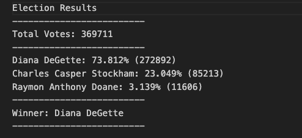

# python_challenge
Week 3

## Part 1 Assignment Overview
## PyBank
In this Challenge, you are tasked with creating a Python script to analyze the financial records of your company. You will be given a financial dataset called budget_data.csv. The dataset is composed of two columns: "Date" and "Profit/Losses".
Your task is to create a Python script that analyzes the records to calculate each of the following values:

1. The total number of months included in the dataset
2. The net total amount of "Profit/Losses" over the entire period
3. The changes in "Profit/Losses" over the entire period, and then the average of those changes
4. The greatest increase in profits (date and amount) over the entire period
5. The greatest decrease in profits (date and amount) over the entire period

(Python Pandas was used to complete this analysis)
## PyBank Analysis

## Part 2 Assignment Overview
## PyPoll
In this Challenge, you are tasked with helping a small, rural town modernize its vote-counting process. You will be given a set of poll data called election_data.csv. The dataset is composed of three columns: "Voter ID", "County", and "Candidate". Your task is to create a Python script that analyzes the votes and calculates each of the following values:

1. The total number of votes cast
2. A complete list of candidates who received votes
3. The percentage of votes each candidate won
4. The total number of votes each candidate won
5. The winner of the election based on popular vote

(Python Pandas was used to complete this analysis)

## PyPoll Analysis
